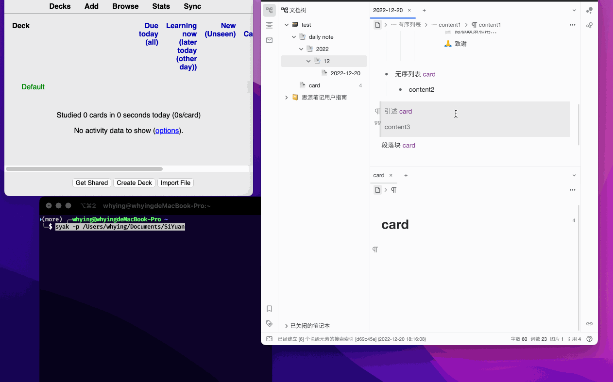

SYAK:同步 SiYuan 内容块到 Anki, 自动更新, 自动删除

> 如果觉得有帮助, 麻烦点个 Star⭐
>

⚠ **初次使用请提前备份 Anki, 以免数据误删!**

# Prerequisite

1. Anki 需要安装 AnkiConnect 插件, code 为 `2055492159`​​​​, 默认端口 `8765`​​​​
2. 支持 Python 3.9 以上版本
3. SiYuan 默认端口为 `6806`​​​​
4. 同步时, 保持 SiYuan 和 Anki 同时运行

# Install

```
pip install -U syak
```

# Usage

1. 新建一个 `card`​​ ​文档块, 名字支持前后缀, 例如 `@card`​​​
2. 在需要制卡的内容块后面引用 `card`​​ ​文档块
3. 制卡内容块为某个容器块下的叶子块时, 卡片正面为制卡内容块, 背面为整个容器块
4. 制卡内容块为文档块下的叶子块时, 卡片正面为制卡内容块, 背面为空
5. 运行命令 `syak -p SiYuan数据根路径(data目录的上一级)`​​ ​即可同步
6. 运行周期任务 `syak -p SiYuan数据根路径(data目录的上一级) -i (seconds)`​, 例如每 5 分钟运行一次 `syak -p SiYuan数据根路径(data目录的上一级) -i 300`​
7. 后台运行

   1. Linux&macOS `nohup syak -p SiYuan数据根路径(data目录的上一级) -i (seconds) &`​
   2. Windows `start /b syak -p SiYuan数据根路径(data目录的上一级) -i (seconds)`​
8. 查看更多选项运行 `syak -h`​​​

# Demo

​​

# Feature

1. 添加 SiYuan URL 跳转链接
2. 自动更新, SiYuan 更新内容块后, Anki 自动更新
3. 自动删除, 删除 `card`​ ​引用块, Anki 自动删除
4. 根据文档块层级自动建立 deck 层级
5. 支持 media 文件
6. 自动删除 empty deck
7. 同步完成时, 发送同步信息给 SiYuan, 停留 5s

# Not Support (currently)

1. Close
2. 代码块语法高亮
3. 超级块未适配

# More

1. macOS 用户如果遇到同步耗时较长的问题, 可以参考:

   1. [FooSoft Productions - Anki-Connect](https://foosoft.net/projects/anki-connect/)

      > Starting with [Mac OS X Mavericks](https://en.wikipedia.org/wiki/OS_X_Mavericks), a feature named *App Nap* has been introduced to the operating system. This feature causes certain applications which are open (but not visible) to be placed in a suspended state. As this behavior causes Anki-Connect to stop working while you have another window in the foreground, App Nap should be disabled for Anki:
      >
      > 1. Start the Terminal application.
      > 2. Execute the following commands in the terminal window:
      >
      >    ```
      >    defaults write net.ankiweb.dtop NSAppSleepDisabled -bool true
      >    defaults write net.ichi2.anki NSAppSleepDisabled -bool true
      >    defaults write org.qt-project.Qt.QtWebEngineCore NSAppSleepDisabled -bool true
      >    ```
      > 3. Restart Anki.
      >

‍